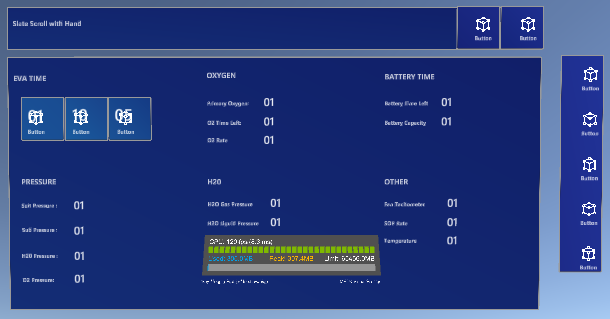

# MRTK-Figma-Bridge-RISD
This Unity Package is RISD's modified branch of [Microsoft's MRTK Figma Bridge for Unity](https://docs.microsoft.com/en-us/windows/mixed-reality/design/figma-unity-bridge), developed for the purpose of expanding functionality as well as better automating the synchronization of MRTK Toolkit UI elements from Figma into Unity.

|  |
|:--:|
| *Example of a directly imported Figma frame maintaining position in front of the user in play mode.* |

## Setup
- Clone the repository into a non-temporary location in your file system.
- Open the Unity Package Manager window _(menu bar "Window" > "Package Manager")_.
- Ensure that the original MRTK Figma Bridge by Microsoft is not installed in the Unity project. If it is, then remove it in order to prevent package conflicts.
- Add the cloned package from your local file system _(plus button in upper left corner > "Add package from disk...")_.

## Usage
- If installed properly, the "RISD" menu bar item should be visible in the Unity Editor.
- To import a Figma file into the current Unity Scene, then from the menu bar, click "RISD" > "Import". Follow the prompts on the opened window in order to import your Figma file using your Figma Token.
- All of the root level Figma frames should be imported, but all should be set to inactive (not enabled) GameObjects in the Unity Scene, in which only one frame is meant to be active at a time.
- Imported frames may not appear exactly as they do in the Figma file, however they should resemble a close approximate.
